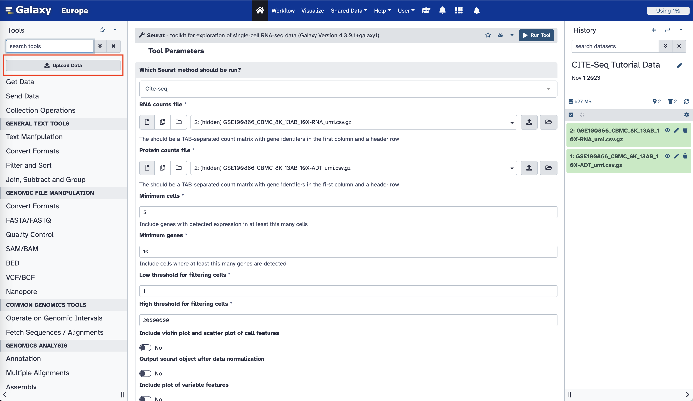
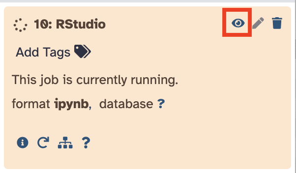

# Introduction
> <comment-title></comment-title>
> This tutorial is significantly based on the Seurat documentation() as well as Seurat's vignette entitled [Using Seurat with multimodal data](https://satijalab.org/seurat/articles/multimodal_vignette).
{: .comment}
 
Multiomic analyses are a new and exciting way to understand the world of biology through bioinformatics! Cite-Seq () is one example of such multimodal technologies. Cite-Seq enables us to measure single cell transcriptomes and cell surface proteins simultaneously. Transcriptomic measurements are achieved via RNA sequencing techniques and the surface protein abundance measurements are quantified via DNA barcoded antibodies. As of current, Cite-Seq boasts its ability to tag up to 125 surface proteins at a time! 

Seurat has kept up to date with the capacities of multimodal technologies such as Cite-Seq, which means once you've familiarized yourself with Seurat, you can seamlessly continue to use the package to analyze and explore many other types multimodal single-cell datasets. 

><comment-title></comment-title>
>Check out [Filter, Plot, and Explore with Seurat]() to start doing so in RStudio with an scRNA-seq dataset!
{: .comment}

Before we can start exploring, we'll process our transcriptomic and surface protein measurements into a Seurat object. The hardworking Galaxy programmers have kindly optimized the Seurat tool to include Cite-Seq functionality. This enables the tool to take our raw csv files as input and output Seurat objects which are easy to explore! 

><comment-title></comment-title>
>If you're interested in what the Seurat tool is doing behind the scenes, check out Seurat's [Using Seurat with multimodal data](https://satijalab.org/seurat/articles/multimodal_vignette) vignette. The first portion of the tutorial is what the Seurat tool accomplishes for us. Ending with the output of a Seurat object which we can then further explore in RStudio.
{: .comment}

# Get Your Data
For this tutorial, we'll use a publicly available dataset of 8,617 cord blood mononuclear cells (CBMCs) which have been sequenced for transcriptomic measurements as well as 11 surface proteins (). 

><comment-title></comment-title>
>A quick note on nomenclature when working with Cite-Seq.
>ADT: ( antibody derived tag) refers to the cell surface protein abundance measurements
>meanwhile RNA: represents the transcriptomic measurements
{: .comment}

First on the to-do list is importing our csv files. You can do this in a couple of ways: 

> **Option 1.**  Use the Upload Data button on the upper left of your screen:
    

Then select the "Paste/Fetch Data" option:

    
Copy the following links into the box:
# IS THERE A BETTER WAY TO FORMAT THIS?
> <hands-on-title></hands-on-title>
> - ADT data: ftp://ftp.ncbi.nlm.nih.gov/geo/series/GSE100nnn/GSE100866/suppl/GSE100866_CBMC_8K_13AB_10X-ADT_umi.csv.gz

> - RNA data: ftp://ftp.ncbi.nlm.nih.gov/geo/series/GSE100nnn/GSE100866/suppl/GSE100866_CBMC_8K_13AB_10X-RNA_umi.csv.gz
{: .hands_on}
   
Select "Start" and then close once both files indicate they are 100% ready. 

The two csv data files should now begin importing into your Galaxy history!  

> **Option 2.** Import A History
You can access [this history](https://usegalaxy.eu/u/camila-goclowski/h/cite-seq-tutorial-data) by clicking on the link provided.



> **Option 3.** Import from a Galaxy Resource Tool
Zenodo? NCBI? OmicsDI?
- Is there another publicly available databse to grab this from? Feels incorrect to upload to Zenodo when it's already publicly available (and not mine!) 
- Exists on OmicsDI but our retrieval tool is still in beta 
- Currently stored on NCBI & currently searching through the NCBI tools to see if one will work for import 

Now we'll run those csv files through the updated Seurat tool with the following parameters:
> <hands-on-title></hands-on-title>
> Run  with the following parameters:
> - *"Which Seuray method should be run"*: `Cite-seq`
> - *"RNA counts file"*: `1: GSE100866_CBMC_8K_13AB_10X-RNA_umi.csv.gz`
> - *"Protein counts file"*: `2: GSE100866_CBMC_8K_10X-ADT_umi.csv.gz`
> - *"Minimum cells"*: `5`
> - *"Minimum genes"*: `10`
> - *"Low threshold for filtering cells"*: ``
> - *"High threshold for filtering cells"*: ``
> - *"Include violin plot and scatter plot of cell features"*: `No`
>  - *"Output seurat object after data normalization"*: `No`
>  - *"Include plot of variable features"*: `No`
>  - *"Output seurat object after data scaling"*: `No`
>  - *"Number of PCs to use in plots"*: `15`
>  - *"Include PCA plots"*: `No`
>  - *"Output seurat object after PCA analysis"*: `No`
>  - *"Perplexity parameter"*: ``
>  - *"Resolution parameter"*: `0.8`
>  - *"Include UMAP and TSNE plots"*: `Yes`
>  - *"Output seurat object after TSNE and UMAP analysis"*: `No`
>  - *"Minimum percent cells"*: `0.1`
>  - *"Log fold change threshold"*: `0.25`
>  - *"Include heatmaps of markers"*: `Yes`
>  - *"Output marker data"*: `Yes`
>  - *"Output list of cite-seq markers"*: `Yes`
>  - *"Compare specific feature's effect on protein and rna expression?"*: `No`
>  - *"Compare top RNA and protein features graphicaly against themselves and one another"*: `No`
>  - *"How many of the top features should be shown"*: `5`
{: .hands_on}

><comment-title></comment-title>
>Note that the parameters listed above are simply one way in which you may use this super useful, one step tool. Feel free to play around with different parameters to see how it changes the data! If you're hoping to follow this tutorial step by step, word for word, be aware that changing any of the above parameters may change the data you get to explore shortly in RStudio. 
{: .comment}

# Move to RStudio
Now that we have some explorable data in our Galaxy history, let's move into RStudio and keep investigating: 
> <hands-on-title>Open RStudio in Galaxy</hands-on-title>
> Run 
{: .hands_on}

><comment-title>Next Step</comment-title>
> The interactive RStudio tool should begin to load now. Make your way over to your Active Interactive Tools page (User (in the top bar of the usegalaxy page) > Active Interactive Tools > RStudio)
> 
>
>Alternatively, you can use the view (eye) icon in your Galaxy History to open the interactive RStudio environment.
> 
{: .comment}

It may be a good time to explore some of these output files that are now in your history. Take a look at some of the previews and see if you can get a grasp of what's what. If not, no worries at all, we'll start looking more closely once we've made it into RStudio!
